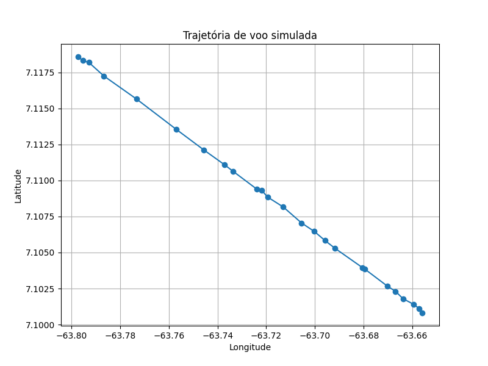

# 🛩️ OpenSky Neuroevo

**Flight trajectory simulation and visualization using neuroevolutionary algorithms and real-world data.**

This project leverages live or historical flight data from the OpenSky Network to simulate and evolve neural networks capable of learning navigation behavior. It focuses on trajectory analysis and the use of evolutionary algorithms to explore air traffic patterns in Latin America.

---

## 🎯 Goals

- Collect and process live or historical flight data from the OpenSky Network.
- Filter relevant flight trajectories for simulation.
- Train evolved neural networks (NEAT) to mimic or optimize navigation behavior.
- Visualize real flight paths and alternative landing options using interactive maps.
- Improve the interpretability of AI by analyzing decision paths and flight routes.

---

## 🧠 Tech Stack

- `Python 3.11+`
- [`neat-python`](https://github.com/CodeReclaimers/neat-python) — NeuroEvolution of Augmenting Topologies
- `pandas`, `numpy`, `matplotlib` — data wrangling and visualization
- `folium` — interactive flight map rendering
- OpenSky Network API (live ADS-B/Mode-S data)

---

## 🗺️ Example Output



You can also view the interactive map: [flight_map.html](results/flight_map.html)

---

## 📁 Project Structure

```

opensky-neuroevo/
├── config/                  # API credentials and NEAT config
│   ├── credentials.json
│   └── neat_config.ini
├── data/                   # Raw and processed datasets
├── results/                # Simulation and visualization outputs
├── src/                    # Source code
│   ├── fetch_data.py
│   ├── preprocess.py
│   ├── flight_rl_env.py
│   ├── neat_train.py
│   ├── map_visualization.py
│   └── environment_config.py
├── requirements.txt
├── README.md
└── main.py

```

---

## 🚀 Getting Started

1. Create a virtual environment:

```bash
python -m venv venv
source venv/bin/activate
```

2. Install dependencies:

```bash
pip install -r requirements.txt
```

3. Set up your OpenSky credentials in `config/credentials.json`:

```json
{
  "clientId": "your-client-id",
  "clientSecret": "your-client-secret"
}
```

4. Launch the interactive explorer (Streamlit):

```bash
streamlit run app.py
# or
python main.py --ui
```

The Streamlit interface allows you to configure algorithm parameters,
generate synthetic storms and flights, and visualize the route evolution
without any terminal interaction. After each run you can inspect the
fitness progression and detailed metrics for every generation directly
in the browser.

---

## 🛬 Airports Configuration

The system considers the **top 10 major airports in Latin America** as possible emergency landing or redirection options during trajectory simulation.

---

## 📚 Academic Context

This repository supports a Master’s research project at **UFRGS** (Federal University of Rio Grande do Sul), under the supervision of **Prof. Dr. Bruno Iochins Grisci**.

---

## 🚧 Status

In active development — contributions and academic collaborations are welcome!

---

## 📄 License

[MIT License](LICENSE)
